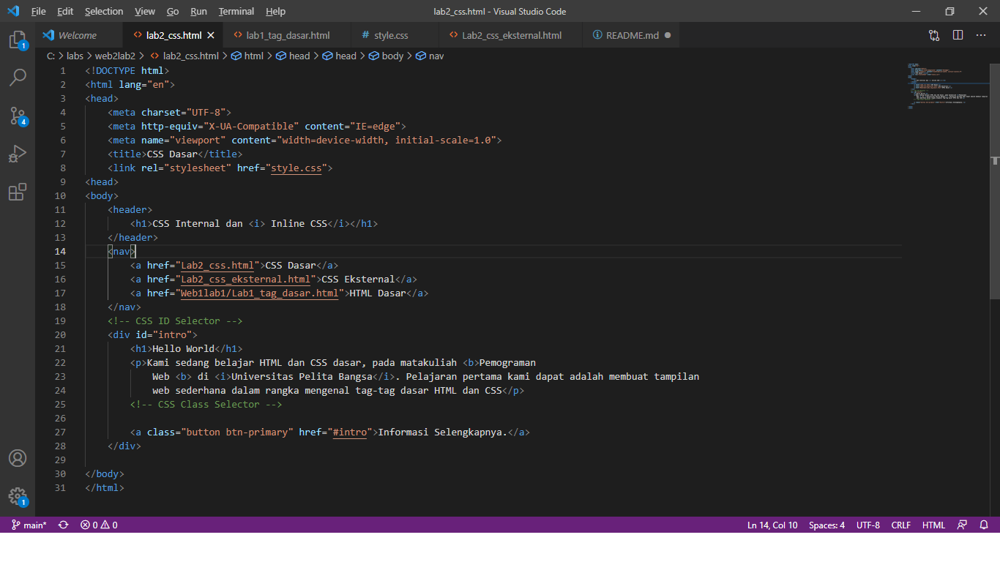
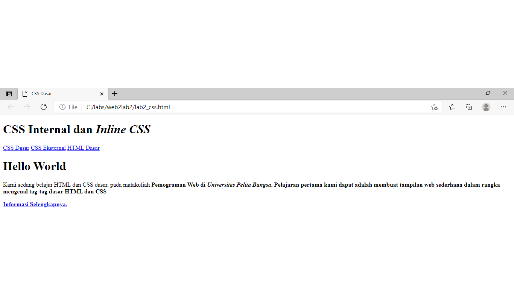
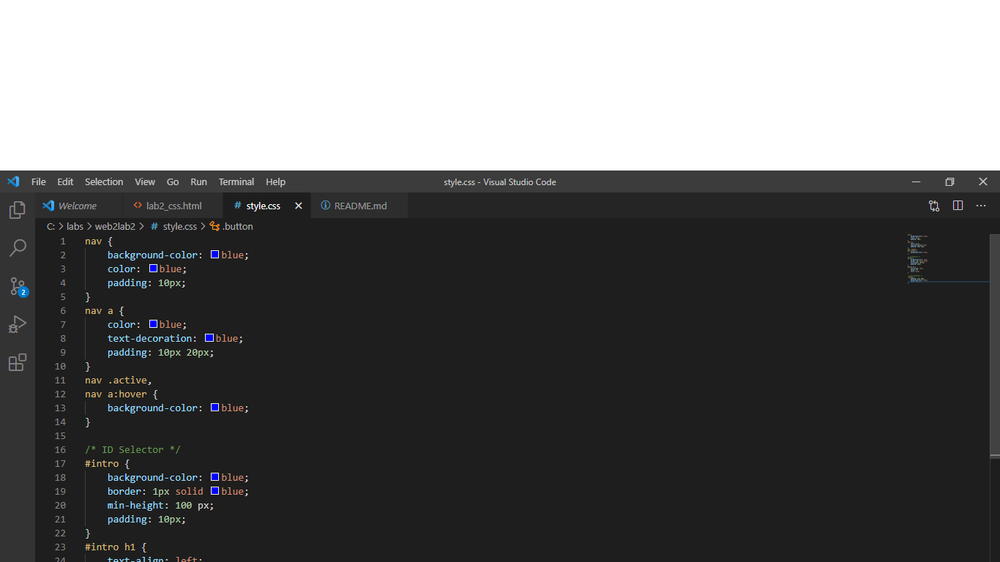
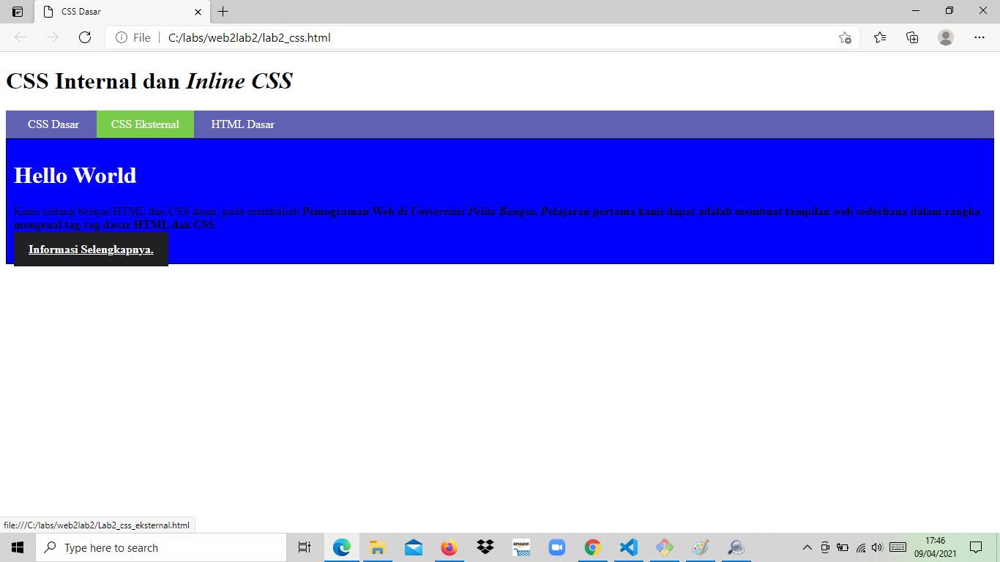

# web1lab1
## Belajar membuat HTML dengan menggunkan CSS Dasar

### menambahkan CSS pada HTML
pengertian CSS '
'
CSS adalah bahasa Cascading Style Sheet dan biasanya digunakan untuk mengatur tampilan elemen yang tertulis dalam bahasa markup, seperti HTML. CSS berfungsi untuk memisahkan konten dari tampilan visualnya di situs.

